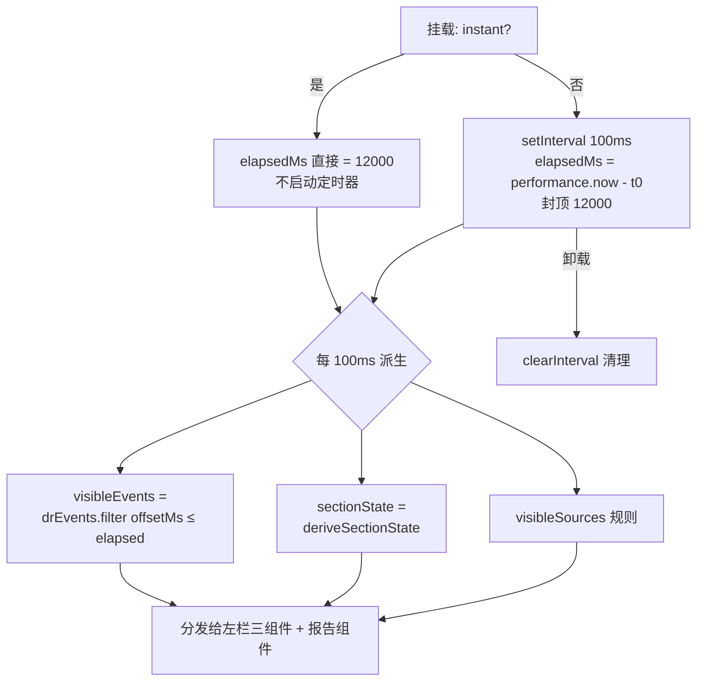

# Deep Research 页面功能与实现说明

> 对应路由:`/agents/deep-research`
> 设计规格:`docs/superpowers/specs/2026-08-07-deep-research-redesign-design.md`
> 实现计划:`docs/superpowers/plans/2026-08-07-deep-research-redesign.md`

## 1. 页面定位

AI 助手栏目下的三档产品阶梯,Deep Research 居中:

| 页面 | 路由 | 定位 |
|---|---|---|
| 深度搜索 | `/agents/deep-search` | 单轮快答:提问 → 带引用的答案卡片(Perplexity 式) |
| **Deep Research** | `/agents/deep-research` | **研究报告型工作台:提问 → 研究计划 → 多轮检索阅读(过程可见)→ 带引用的长篇结构化报告** |
| Auto Research | `/agents/auto-research` | 自治流水线:16 节点流程画布 + 诚信门,可编排、多档自治 |

与深度搜索的差异:不是"更长的答案",而是**过程与产物同屏**——左栏展示 agent 的研究过程(计划、步骤、来源),右栏报告随进度逐节生成,过程为报告提供可核查的信任链。

## 2. 入口与 URL 参数

| 入口 | 行为 |
|---|---|
| 侧边栏「AI 助手 → Deep Research」 | 进入入口态(home) |
| `?q=xxx` | 预填问题,进入 session 从头播放;空串停留 home 并聚焦输入框 |
| `?autostart=1` | 进入 session 从头播放(演示用,注意判定是严格 `=== "1"`) |
| `?mode=instant` | 直接进入完成态(历史记录 / headless 截图用;与 autostart 并存时优先) |

参数在客户端 `useEffect` 里用 `URLSearchParams` 解析(沿用 auto-research 的 research-board 惯例,规避 `useSearchParams` 的 Suspense 约束,同时保持路由静态预渲染 `○`)。

## 3. 页面结构:单路由两视图

`deep-research-page.tsx` 是一个视图机,`view: "home" | "session"`:

```
┌─ home(入口态,默认)────────────────────────────┐
│  Hero(图标 + 标题 + 一句话定位)                 │
│  研究问题输入卡(textarea + 范围 chips + 开始研究)│
│  建议主题(点击填入输入框)                       │
│  历史研究(4 张卡,点击进完成态示例报告)          │
└───────────────────────────────────────────────┘
        │ onStart(q) / onOpenHistory()
        ▼  sessionKey 自增 → 重挂载工作台
┌─ session(双栏工作台)──────────────────────────┐
│  顶条:← 返回 · 研究问题 · 状态徽标 · 耗时 · 导出/分享 │
│ ┌─────────────┬─────────────────────────────┐ │
│ │ 左栏 340px   │ 右栏(flex-1)               │ │
│ │ 研究计划卡    │ 报告头(标题/摘要/数字条)      │ │
│ │ 步骤时间线    │ 章节区(三态)                │ │
│ │ 来源墙       │ 参考文献(全部完成后出现)      │ │
│ │ (可折叠 48px)│ 追问输入框(复用 ChatInput)   │ │
│ └─────────────┴─────────────────────────────┘ │
└───────────────────────────────────────────────┘
```

要点:

- **sessionKey 重挂载**:每次进入 session 自增 `key`,工作台整体重挂载,运行从头播放;「返回」重置 instant 并回 home。
- **openHistory 重置问题**:历史卡片加载示例报告前先把 question 重置为 `drReport.question`,避免用户自定义问题泄漏进历史视图。
- **左栏折叠**:workbench 内 `useState`,折叠后剩 48px 展开钮。

## 4. 组件拆解

全部位于 `components/features/deep-research/`:

| 文件 | 职责 | 状态 |
|---|---|---|
| `deep-research-page.tsx` | 视图机 + URL 参数解析 + sessionKey 管理 | client |
| `deep-research-home.tsx` | 入口态全部(Hero/输入卡/建议/历史),提交上抛 | client(输入与范围 chips 本地 state) |
| `research-workbench.tsx` | session 骨架:顶条 + 双栏 + 折叠;调用运行 hook 并分发状态 | client |
| `use-deep-research-run.ts` | 运行播放器 hook(见 §6) | client hook |
| `plan-card.tsx` | 研究计划大纲,节状态点(灰/蓝脉冲/绿) | 纯展示,props 驱动 |
| `step-timeline.tsx` | 步骤时间线,kind→图标(search/read/analyze/write),最新一条高亮 | 纯展示 |
| `source-wall.tsx` | 来源 chips 墙,hover title 显示全名;count 有 Math.min 夹取 | 纯展示 |
| `report-viewer.tsx` | 报告头 + 章节三态 + 对比表 + 趋势列表 + 参考文献 | 纯展示 |

共享:`withCitations`(`lib/citations.tsx`)把正文 `[n]` 渲染为主色上标,answer-card(深度搜索)与 report-viewer 共用。追问输入框直接复用 `components/features/agent/chat-input.tsx`。

## 5. 数据模型

`types/index.ts` 的 `DR*` 类型 + `features/deep-research/data.ts` 的 mock 数据(扩散模型主题,与深度搜索页演示数据同语境):

```ts
drPlan: DRPlanSection[]      // 4 节大纲 { id: s1-s4, title, query }
drReport: DRReport           // question/title/abstract/stats{read:28,cited:15}
                             //   + sections(4 节,含段落/可选对比表/可选编号列表)
                             //   + references(15 条,引用编号 [n] 与正文上标一一对应)
drEvents: DRStepEvent[]      // 9 条预录事件(见 §6)
DR_RUN_TOTAL_MS = 12000      // 运行总时长
drHistory / drSuggestions / drScopeOptions  // 入口态数据
```

内容约束:正文 `[n]` 引用标记与 references 的 `id` 必须互为闭合(每条参考文献至少被引用一次,每个 `[n]` 都有对应条目)。

## 6. 运行播放机制("算法流程")

原型无后端,研究过程是**确定性预录事件流的回放**(刻意不用随机,与 auto-research 的 research-run 同款思路)。

### 6.1 事件流(drEvents)

9 条事件按 `offsetMs` 排列在 12s 时间轴上:

```
0.9s   search   检索「diffusion policy robot manipulation」· 命中 32 个来源
2.5s   search   扩展检索「VLA / 世界模型 技术路线」· 补入 14 个来源
4.2s   read     去重、按引用量与时效加权,精读 28 篇
5.6s   analyze  按方法谱系聚类,归纳 3 条技术主线
6.8s   write    撰写第 1 节 · 代表性方法与技术脉络      (sectionId: s1)
8.0s   write    撰写第 2 节 · 性能对比与评测基准        (sectionId: s2)
9.2s   write    撰写第 3 节 · 工业部署现状与瓶颈        (sectionId: s3)
10.4s  write    撰写第 4 节 · 趋势展望与研究方向        (sectionId: s4)
11.3s  analyze  交叉核对引用,生成参考文献列表(15 篇)
12.0s  (DR_RUN_TOTAL_MS,播完即 done)
```

注意:plan_ready 不占事件(初始态即表达"计划已就绪"),done 也不占事件(由播完推导)。

### 6.2 播放器(useDeepResearchRun)



核心派生逻辑(全部为 `elapsedMs` 的纯函数,无额外状态):

1. **可见事件**:`drEvents.filter(e => e.offsetMs <= elapsedMs)`。
2. **节三态**(`deriveSectionState`,计划卡与报告节共用一份):
   - 该节的 write 事件已出现,且没有更靠后的节开始、运行也未结束 → `running`(生成中)
   - 更靠后的节已开始、或运行结束 → `done`(已生成)
   - 否则 → `todo`(待生成)
3. **来源墙条数**:任一 read 事件可见 → 全量 15 条;此前任一 search 可见 → 先出 8 条;否则 0。
4. **phase**:`elapsedMs >= DR_RUN_TOTAL_MS` → `done`,否则 `running`(驱动顶条徽标与耗时显示)。

instant 模式只是初始值差异:`useState(() => instant ? TOTAL : 0)`,不启动 interval——因此完成态无定时器空转,SSR/首帧即终态,截图稳定。

### 6.3 状态到 UI 的映射

| 派生态 | 研究计划卡 | 报告章节 |
|---|---|---|
| `todo` | 灰点 + 淡色标题 | 虚线灰框「待生成」占位 |
| `running` | 蓝色脉冲点 | 主色边框高亮 + 首段正文 + 呼吸光标 |
| `done` | 绿点 | 完整内容(段落/对比表/趋势列表) |

参考文献列表在全部节 `done` 时出现(带非空守卫,防空对象 vacuous-true)。

## 7. 验证方式

- `pnpm build`:编译 + 类型检查;`/agents/deep-research` 应保持静态 `○`。
- 截图(shot_pages.py / shot_themes.py,Windows Edge headless):
  - `f_dr_home.png` 入口态 / `f_dr_running.png` 进行中 / `f_dr_report.png` 完成态
  - `theme-dr-home-night.png` / `theme-dr-report-night.png` 夜间
  - `f_deep_search.png` 旧页回归
- **坑**:参数驱动页(effect 解析 URL)不能用 `--virtual-time-budget` 截图——虚拟时间快进而 effect 未 flush,拍到的永远是 SSR 首帧。这两个页面走 `scripts/shot-cdp.mjs`(Windows node + CDP 管道,轮询目标文本出现后截图)。

## 8. 原型边界与后端接入点

当前是**纯前端原型**:数据全部 mock,播放是预录回放。导出/分享/计划编辑仅展示;历史卡片都加载同一份示例报告;来源墙 chips 只有 hover 提示。

后端接入时的替换面(刻意收口,便于将来替换):

| 现在 | 将来 |
|---|---|
| `features/deep-research/data.ts` 的静态数据 | API 返回的研究计划/报告结构(types 已就位) |
| `useDeepResearchRun` 的 interval + offsetMs 过滤 | SSE/WebSocket 推送事件,直接替换 visibleEvents 的来源;`deriveSectionState` 等派生逻辑可原样保留 |
| `?mode=instant` | 已完成会话的服务端快照 |
| 历史卡片加载同一份示例 | 按会话 id 拉取 |

只要保持「事件流 + 纯函数派生」的边界,前端展示层不需要改动。
